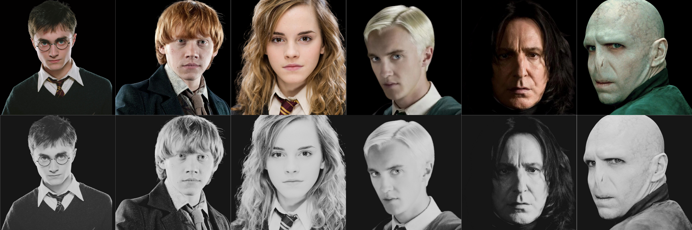
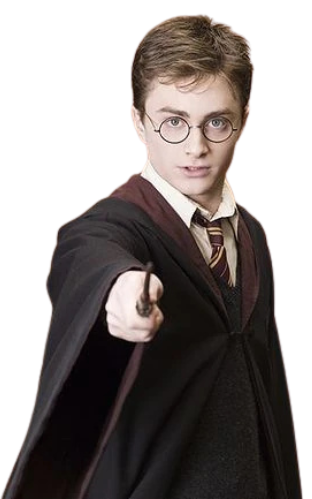
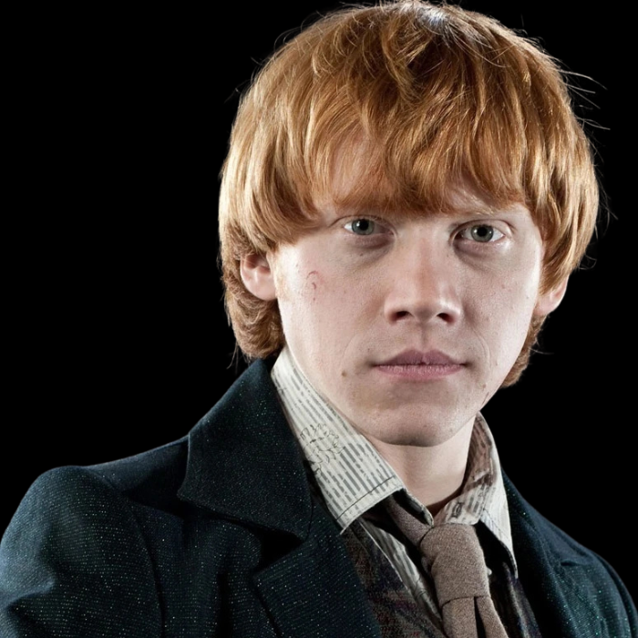
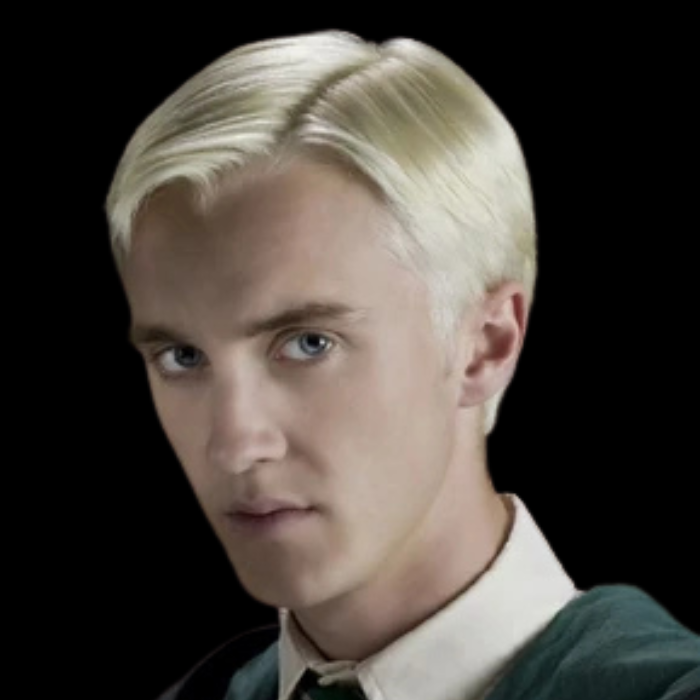
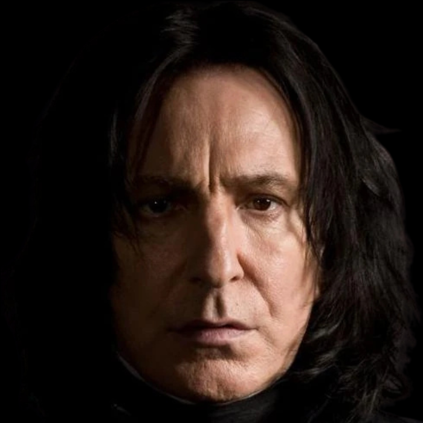
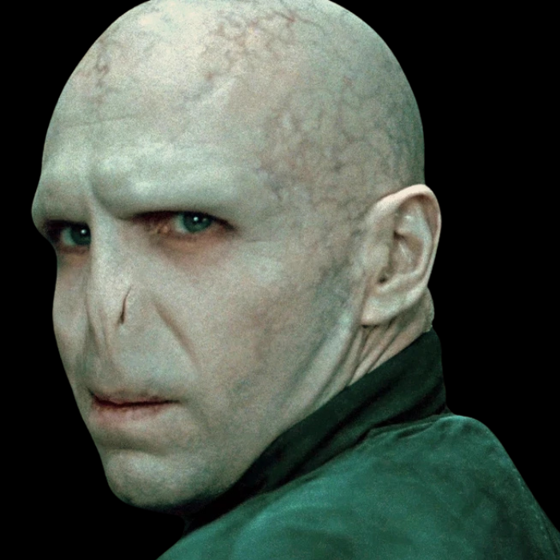

HW2 - Character Build (CSS Selection and Styles)
=======

# NgocDan_Le_HW-2_Character_Build

## HW2 - Character Build (CSS Selection and Styles)

### Harry Potter Character Build - Fall 2024

**Discover Your Hogwarts Wizards!**

  

---

> "In a world hidden from the eyes of Muggles, where magic breathes life into ancient castles and whispers fill enchanted forests, there are heroes whose stories have captured our hearts for generations. Each character from the Wizarding World of Harry Potter teaches us the true meaning of bravery, loyalty, and friendship. Whether a young wizard, a wise professor, or a complex antagonist, each one has faced trials and adventures that shaped their path at Hogwarts.
>
> From secret chambers and forbidden forests to the hallowed halls of Hogwarts itself, these characters embark on journeys filled with wonder, peril, and moments of self-discovery. With courage to face the darkest fears and hearts devoted to those they love, they invite you to step into their stories. Each tale reveals strength, resilience, and magic that make these wizards and witches unforgettable legends in the wizarding world.
>
> As you explore this realm, hover over or click on each character to discover the magic woven into their stories—their friendships, rivalries, and battles for a world where good triumphs over darkness. In this enchanting universe, you’ll meet wizards who dared to stand up for what was right, who fought against all odds, and who showed that true power lies not just in magic, but in love and sacrifice. So step forward, for your own adventure at Hogwarts awaits..."

**Hover over or click on each character to uncover their unique journey and magical legacy at Hogwarts!**

---

## Character Descriptions

### Harry Potter

**The Boy Who Lived**

Harry Potter is the main character in the series, known as "The Boy Who Lived." He grew up with his abusive aunt and uncle before learning that he is a wizard and destined to face the dark wizard Voldemort.

Harry embodies bravery, resilience, and loyalty to his friends and cause. Throughout his journey, he confronts numerous challenges, ultimately defeating Voldemort and restoring peace to the wizarding world.

---

### Ron Weasley

**The Loyal Friend**

Ron Weasley, Harry's loyal best friend, is known for his bravery, humor, and strong sense of loyalty. Coming from a large family, Ron often feels overshadowed but proves himself to be a true Gryffindor through his courage and dedication.

Throughout the series, Ron stands by Harry and Hermione, facing numerous dangers and helping Harry in the fight against Voldemort.

---

### Hermione Granger

**The Brightest Witch**

Hermione Granger is known for her intelligence, determination, and dedication to her friends. She is often considered the brightest witch of her age and is an invaluable ally to Harry and Ron.

Her quick thinking and extensive knowledge of magic make her a key player in the fight against Voldemort, proving that bravery and wisdom go hand in hand.

---

### Draco Malfoy

**The Ambitious Rival**

Draco Malfoy is Harry's rival at Hogwarts, known for his ambition and pride in his pure-blood heritage. Though often seen as a bully, Draco is a complex character, facing pressure from his family and the expectations of Slytherin House.

Over time, Draco's story reveals the internal conflict he experiences between loyalty to his family and his own personal beliefs.

---

### Severus Snape

**The Complex Hero**

Severus Snape is a complex character who begins as an antagonist but ultimately reveals his deep loyalty and love for Lily Potter, Harry's mother. Snape serves as a double agent, risking his life to protect Harry and defeat Voldemort.

Known for his strict demeanor and sharp intelligence, Snape's true motivations remain hidden until the end, making him one of the most profound characters in the series.

---

### Lord Voldemort

**The Dark Lord**

Lord Voldemort, born as Tom Riddle, is the main antagonist of the series. Known for his dark ambition and quest for immortality, he is feared throughout the wizarding world and is the one responsible for the death of Harry's parents.

Voldemort embodies the darkest side of ambition, stopping at nothing to achieve power. His influence and actions serve as a constant threat to Hogwarts and the wizarding world, ultimately leading to a final showdown with Harry Potter.

